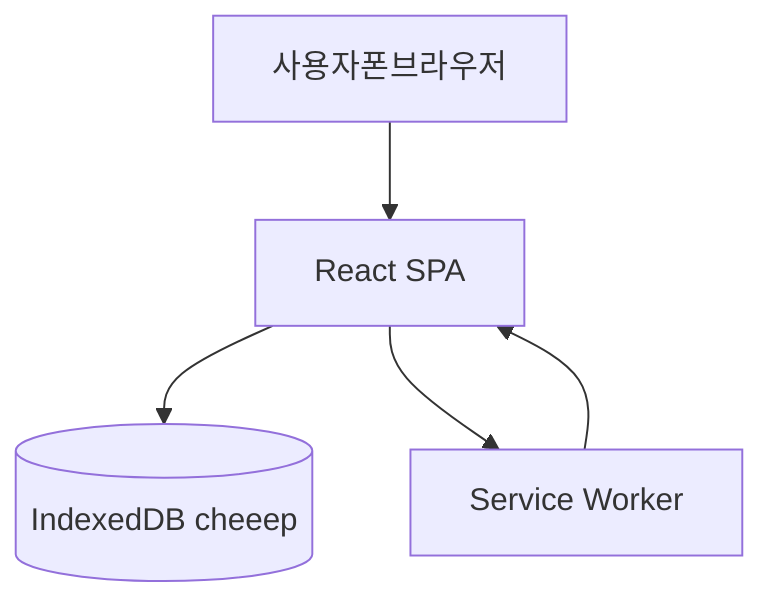
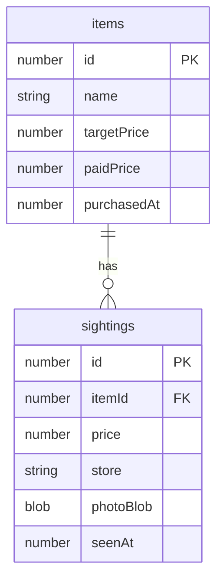

# Cheeep 기술명세서

버전: 0.0.0 (코드 기준)  
문서 기준일: 2026-09-02  
대상: 로컬 전용 모바일 우선 PWA

---

## 1. 개요

Cheeep은 **내가 사고 싶은 물건(위시)** 에 **매장에서 직접 본 가격**을 쌓고, 그 기록 안에서 **최저가 구입처를 맨 위에 보여 주는** 웹앱이다.

외부 쇼핑몰을 검색하거나 크롤링하지 않는다. 비교 기준은 사용자 본인이 남긴 기록뿐이다. 서버·회원가입·계정 동기화는 없다. 데이터는 **이 기기의 브라우저 IndexedDB**에만 저장된다.

핵심 사용자 흐름:

1. 이름만으로 위시에 넣는다. (사진·가격 불필요)
2. 선택으로 **기준가**(이 정도면 사겠다는 금액)를 적는다.
3. 매장에서 **금액 + 구입처 + 사진(생략 가능)** 을 기록한다.
4. 검색·상세에서 해당 위시의 **최저가 구입처가 상단 고정**된다.
5. 실제로 사면 **구매완료**와 **구매한 금액**을 남긴다.

---

## 2. 범위

### 2.1 포함

- 위시 CRUD (이름 필수, 기준가 선택)
- 가격 기록(sighting) CRUD: 금액, 구입처, 사진 0~1장, 메모, 본 날짜
- 최저가 계산 및 정렬 (가격 오름차순, 같으면 최근순)
- 이름·구입처 검색
- 구매완료 / 구매한 금액 / 위시로 되돌리기
- 기준가와 최저가·구매금액 비교 표시
- 모바일 레이아웃, 한국어 UI
- PWA (홈 화면 추가, 서비스 워커 캐시, 오프라인 셸)

### 2.2 제외

- 로그인, 클라우드 동기화, 기기 간 공유
- 쇼핑몰·공개 최저가 API
- 바코드/QR
- 단위가격 자동 계산
- 데이터 내보내기/가져오기
- 다계정, 권한, 관리자

---

## 3. 시스템 구조

서버가 없는 단일 페이지 앱이다. 브라우저가 UI, 라우팅, 저장, 사진 압축을 모두 처리한다.



| 계층 | 역할 |
| --- | --- |
| 표현 | React 19, 모바일 단일 컬럼 CSS (`max-width: 480px`) |
| 라우팅 | `react-router-dom` `BrowserRouter` |
| 저장 | Dexie 4 → IndexedDB, DB 이름 `cheeep` |
| 오프라인 | `vite-plugin-pwa`, `registerSW({ immediate: true })` |
| 빌드 | Vite 8 + TypeScript |

백엔드 API, 인증, 원격 스토리지는 없다.

---

## 4. 기술 스택

| 구분 | 기술 | 버전 (package.json) |
| --- | --- | --- |
| 런타임 UI | React, React DOM | ^19.2.8 |
| 언어 | TypeScript | ~6.0.2 |
| 번들러 | Vite | ^8.2.2 |
| 라우터 | react-router-dom | ^7.18.3 |
| DB | Dexie | ^4.4.5 |
| PWA | vite-plugin-pwa | ^1.3.0 |
| 린트 | oxlint | ^1.79.0 |

실행 스크립트:

- `npm run dev` — 개발 서버. `server.host: true` 로 LAN 접속 가능
- `npm run build` — `tsc -b && vite build`
- `npm run preview` — 프로덕션 빌드 미리보기
- `npm run lint` — oxlint

---

## 5. 데이터 모델

### 5.1 데이터베이스

- Dexie 스키마 이름: `cheeep`
- 현재 스키마 버전: **2**
- v1: `items`, `sightings` 기본 인덱스
- v2: `items`에 `purchasedAt` 인덱스 추가
- `targetPrice`, `paidPrice` 는 인덱스 없이 레코드 필드로만 존재 (v2 이후 필드 추가, 스키마 버전 증가 없음)

### 5.2 `items` (위시)

| 필드 | 타입 | 필수 | 설명 |
| --- | --- | --- | --- |
| id | number | 자동 | 기본키 `++id` |
| name | string | 예 | 위시 이름. trim 후 저장 |
| createdAt | number | 예 | epoch ms |
| updatedAt | number | 예 | 위시·기록·구매 변경 시 갱신. 목록 정렬 키 |
| targetPrice | number | 아니오 | 기준가(원). 양의 정수 |
| purchasedAt | number | 아니오 | 구매완료 시각. 있으면 구매완료 탭 |
| paidPrice | number | 아니오 | 실제로 산 금액(원) |

구매완료 판정 (`isPurchased`): `purchasedAt != null && paidPrice != null`.

위시 삭제 시 해당 `itemId`의 sighting을 같은 트랜잭션에서 함께 삭제한다.

### 5.3 `sightings` (가격 기록)

| 필드 | 타입 | 필수 | 설명 |
| --- | --- | --- | --- |
| id | number | 자동 | 기본키 |
| itemId | number | 예 | 위시 FK (앱 레벨, DB FK 없음) |
| price | number | 예 | 본 가격(원), 양의 정수 |
| store | string | 예 | 구입처 |
| photoBlob | Blob | 아니오 | JPEG 압축 이미지 1장 |
| memo | string | 아니오 | 빈 문자열은 저장하지 않음 |
| seenAt | number | 예 | 본 날짜 (로컬 자정 기준 epoch) |

인덱스: `++id, itemId, price, seenAt, store`.

### 5.4 관계



한 위시에 가격 기록 N건. 최저가는 조회 시 계산하며 별도 컬럼으로 캐시하지 않는다.

---

## 6. 업무 규칙

### 6.1 최저가

```
sort: price ASC, 같으면 seenAt DESC
cheapest = 정렬 결과의 첫 건
```

목록 카드·상세 히어로·기록 리스트 상단에 동일 규칙을 쓴다.

### 6.2 검색

- 대상: 위시 `name`, 그 위시에 속한 sighting의 `store`
- 비교: trim + 소문자 `includes`
- 탭이 `위시`이면 미구매만, `구매완료`이면 구매완료만
- 위시 탭에서 결과 없음 + 검색어 있음 → “이 이름으로 위시에 넣기”

### 6.3 금액

- 입력에서 숫자가 아닌 문자를 제거한 뒤 파싱
- 0 이하·NaN 은 거부
- 표시: `ko-KR` 천 단위 + `원`
- 기준가: 비우면 필드 삭제. 잘못된 숫자만 오류

### 6.4 기준가 비교

비교 대상이 기준가보다 작거나 같으면 “이하/같음/쌈”, 크면 “비쌈”과 차액을 표시한다.

- 위시 목록: 최저가 vs 기준가 (`기준가 이하` / `기준가보다 비쌈`)
- 상세: 최저가 vs 기준가
- 구매완료: 구매한 금액 vs 기준가, 그리고 최저가 기록이 있으면 최저가 vs 구매금액

### 6.5 구매완료

- 구매한 금액 필수. 최저가 기록이 있으면 폼에 미리 채움
- 완료 후 위시 탭에서 숨기고 구매완료 탭에 표시
- 위시로 되돌리기: `paidPrice`, `purchasedAt` 삭제. 가격 기록은 유지
- 구매한 금액 수정: 같은 폼, `purchasedAt`은 다시 `Date.now()`로 덮어씀

### 6.6 사진

- 기록당 최대 1장, 생략 가능
- `<input type="file" accept="image/*" capture="environment">`
- 저장 전 `createImageBitmap` + canvas: 긴 변 최대 1280px, JPEG quality 0.82
- 표시: `URL.createObjectURL` / unmount 시 revoke (`useBlobUrl`)

### 6.7 구입처 제안

기존 sighting의 `store` unique 값을 `datalist`로 제안한다.

---

## 7. 화면과 라우트

하단 고정 내비: `위시` (`/`), `+ 위시` (`/new`). 모든 화면에 노출.

| 경로 | 화면 | 동작 |
| --- | --- | --- |
| `/` | Home | 검색, 위시/구매완료 탭, 카드 목록 |
| `/new` | NewItem | 이름 필수, 기준가 선택. 저장 후 `/` |
| `/items/:id` | ItemDetail | 히어로(최저가 또는 구매완료), 기준가, 기록 타임라인, 삭제 |
| `/items/:id/target` | TargetForm | 기준가 저장/삭제(빈 값) |
| `/items/:id/buy` | BuyForm | 구매완료·구매금액 |
| `/items/:id/record` | SightingForm | 새 가격 기록 |
| `/items/:id/record/:sid` | SightingForm | 기록 수정 |
| `*` | — | `/` 로 리다이렉트 |

목록 정렬: `items.updatedAt` 내림차순.

알 수 없는 id: 상세에서 “물건을 찾을 수 없습니다.”

---

## 8. 프론트엔드 구성

```
src/
  main.tsx          엔트리, SW 등록, BrowserRouter
  App.tsx           라우트 + BottomNav
  db.ts             Dexie 스키마, CRUD, 최저가 정렬
  lib.ts            금액/날짜/이미지 압축, 기준가 문구
  Home.tsx
  NewItem.tsx
  ItemDetail.tsx
  TargetForm.tsx
  BuyForm.tsx
  SightingForm.tsx
  BottomNav.tsx
  Thumb.tsx
  useBlobUrl.ts
  index.css         모바일 테마
public/
  icon.svg
```

상태: 서버 상태 라이브러리 없음. 화면 진입 시 Dexie 조회로 로드한다. 홈은 마운트 시 1회 로드하므로 다른 화면에서 돌아와도 최신을 보려면 홈이 다시 마운트되어야 한다 (라우트 전환 시 재마운트).

---

## 9. PWA · 오프라인 · 보안

### 9.1 매니페스트

- name / short_name: Cheeep
- lang: ko
- display: standalone
- theme_color: `#0f766e`
- background_color: `#f4efe6`
- start_url: `/`
- icon: `icon.svg` (`any`)

`index.html`: `viewport-fit=cover`, apple-mobile-web-app-capable.

### 9.2 오프라인

앱 셸(정적 자산)은 서비스 워커가 프리캐시한다. 사용자 데이터는 IndexedDB라 네트워크가 없어도 읽기/쓰기가 가능하다. 다만 최초 설치 전에 자산을 받지 못하면 오프라인 실행이 안 된다.

### 9.3 보안·프라이버시

- 전송할 서버가 없어 앱 데이터가 네트워크로 나가지 않음
- Origin별 IndexedDB. 사이트 데이터 삭제, 다른 브라우저, 다른 기기면 데이터 없음
- XSS: 사용자 문자열은 React 텍스트 노드로 렌더. `dangerouslySetInnerHTML` 없음
- 사진은 로컬 Blob만 사용

---

## 10. UI 제약

- 최대 폭 480px, 하단 내비 높이 64px + safe-area
- 주요 터치 영역 최소 높이 약 44~48px
- 금액 입력 `inputMode="numeric"`
- 확인 대화상자: `window.confirm` (삭제, 구매완료 취소)

---

## 11. 실행·배포

로컬만 가정한다. 별도 백엔드 배포 없음.

```bash
npm install
npm run dev
```

같은 Wi-Fi의 폰에서 개발 서버 주소로 접속한다. 브라우저 메뉴에서 홈 화면에 추가할 수 있다.

프로덕션은 정적 파일(`dist/`)을 아무 정적 호스트에 올리면 된다. **HTTPS**가 아니면 PWA 설치·카메라 제약이 생길 수 있다. `file://` 로 열면 라우팅·저장이 깨질 수 있다.

---

## 12. 알려진 한계

- 동기화 없음. 브라우저/기기 변경 시 데이터 소실
- IndexedDB 용량 한도(브라우저·디스크). 사진이 쌓이면 한도에 걸릴 수 있음
- PWA 아이콘이 SVG `any`만 있어, 일부 환경에서 설치 아이콘이 기대와 다를 수 있음
- 홈 검색어는 컴포넌트 로컬 state. 탭만 바꿔도 검색어는 유지됨
- 구매금액 수정 시 구매 시각이 현재 시각으로 갱신됨
- 단위·수량 없음. 같은 상품 다른 용량은 위시를 따로 만들어야 함
- 자동화 테스트 스위트 없음 (개발 중 수동·헤드리스 브라우저로 주요 흐름 확인)

---

## 13. 향후 확장 시 주의

클라우드 동기화를 넣을 경우 사진 Blob, IndexedDB 키, 충돌(같은 위시 다른 기기)을 새로 설계해야 한다. 현재 CRUD는 단일 로컬 사용자 전제다.

데이터 내보내기는 `items` + `sightings`(Blob → base64 또는 별도 파일) JSON/ZIP이 자연스럽다.

월 예산은 미구매 위시의 `targetPrice` 합, 구매완료의 `paidPrice` 합으로 파생 가능하다.
